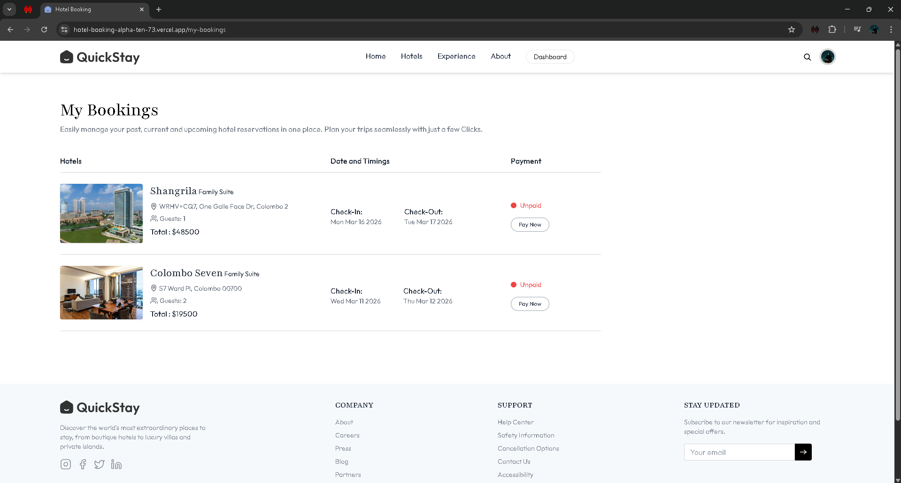
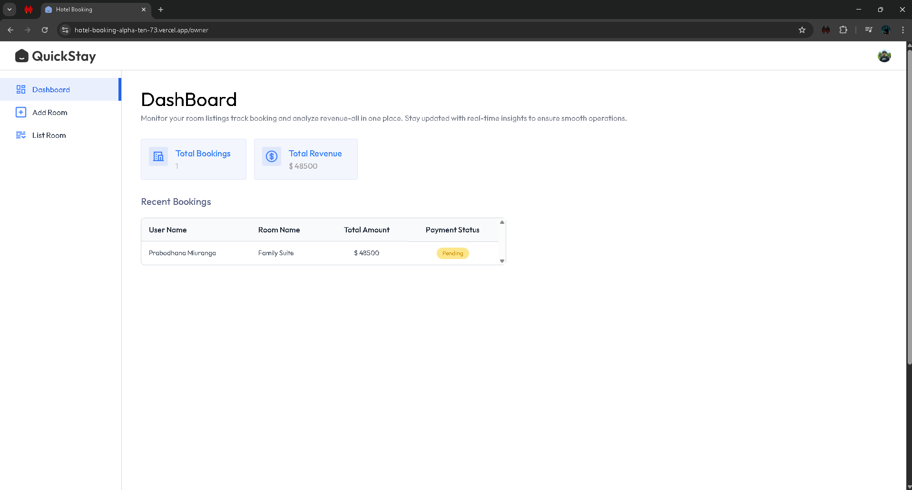
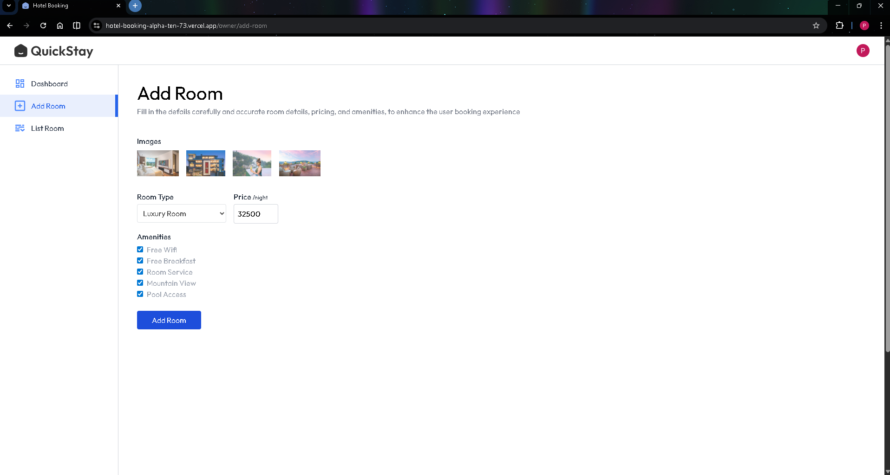

<div align="center">

# 🏨 Hotel Booking App

A modern **full-stack hotel booking platform** where users can browse hotels, explore rooms, and make reservations.
Hotel owners can manage rooms, bookings, and images through a dedicated dashboard.

### 🌐 Live Demo

https://hotel-booking-alpha-ten-73.vercel.app/


</div>

---

# ✨ Features

### 👤 User Features

* Browse hotels and rooms
* View detailed hotel information
* Book rooms instantly
* Manage bookings
* Secure authentication

### 🏨 Hotel Owner Features

* Owner dashboard
* Add and manage hotel rooms
* Upload room images
* Track reservations

### 🔐 Security

* Clerk authentication
* Protected API routes
* Environment variable configuration

---

# 🚀 Tech Stack

## Frontend

* React
* Vite
* Tailwind CSS
* React Router
* Clerk Authentication

## Backend

* Node.js
* Express
* MongoDB (Mongoose)
* Cloudinary (Image storage)
* Nodemailer (Email service)

---

# 📸 Application Screenshots

### 🏠 Home Page


---

### 🏨 Hotel Details


---

### 📅 Booking Page


---

### 📋 My Bookings



---

### 📊 Owner Dashboard



---

### 🛠 Manage Rooms



---

# 📁 Project Structure

```
Hotel-Booking-App
│
├── client/           # React frontend
│
├── server/           # Express backend
│   ├── controllers/
│   ├── routes/
│   ├── models/
│   ├── middleware/
│   └── config/
│
├── screenshots/      # README images
│
└── README.md
```

---

# ⚙️ Getting Started

## 1️⃣ Clone Repository

```bash
git clone https://github.com/yourusername/hotel-booking-app.git
cd Hotel-Booking-App
```

---

# 🖥 Backend Setup

```
cd server
npm install
```

Create `.env` file inside **server/**

```
PORT=5000

MONGODB_URI=your_mongodb_connection

CLERK_SECRET_KEY=your_clerk_secret
CLERK_WEBHOOK_SECRET=your_webhook_secret

CLOUDINARY_CLOUD_NAME=your_cloud_name
CLOUDINARY_API_KEY=your_api_key
CLOUDINARY_API_SECRET=your_api_secret

SENDER_EMAIL=your_email

SMTP_USER=your_smtp_user
SMTP_PASS=your_smtp_password
```

Run backend:

```
npm run dev
```

---

# 💻 Frontend Setup

```
cd client
npm install
npm run dev
```

Create `.env` inside **client/**

```
VITE_CLERK_PUBLISHABLE_KEY=your_clerk_publishable_key
VITE_BACKEND_URL=http://localhost:5000
VITE_CURRENCY=LKR
```

Frontend runs at

```
http://localhost:5173
```

---

# 📡 API Routes

### User

```
/api/user
```

### Hotels

```
/api/hotels
```

### Rooms

```
/api/rooms
```

### Bookings

```
/api/bookings
```

### Clerk Webhooks

```
/api/clerk
```

---

# 🌍 Deployment

The project is deployed on **Vercel**

```
Frontend → Vercel
Backend → Vercel Serverless API
```

Backend example:

```
https://hotel-booking-backend-sigma-topaz.vercel.app
```

---

# 🔮 Future Improvements

* Stripe payment integration
* Hotel reviews and ratings
* Advanced search filters
* Booking calendar
* Push notifications
* Admin management panel

---

# 🤝 Contributing

1. Fork the repository
2. Create a branch

```
git checkout -b feature/new-feature
```

3. Commit changes

```
git commit -m "Add new feature"
```

4. Push

```
git push origin feature/new-feature
```

5. Open Pull Request

---

# 📄 License

MIT License

---

<div align="center">

⭐ If you like this project, consider **starring the repository**.

</div>
