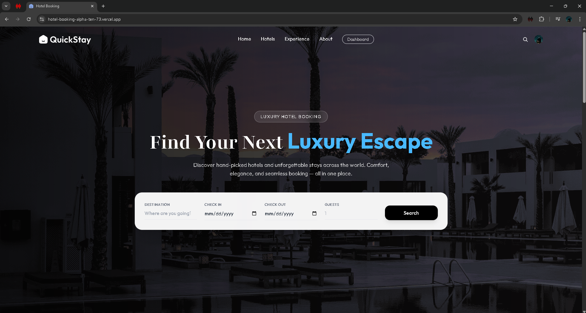

<div align="center">

# 🏨 Hotel Booking App

A modern **full-stack hotel booking platform** where users can browse hotels, explore rooms, and make reservations.
Hotel owners can manage rooms and bookings through a dedicated dashboard.

### 🌐 Live Demo

🔗 https://hotel-booking-alpha-ten-73.vercel.app/


</div>

---

# 🚀 Tech Stack

## Frontend

* ⚛️ React
* ⚡ Vite
* 🎨 Tailwind CSS
* 🧭 React Router

## Backend

* 🟢 Node.js
* 🚂 Express
* 🍃 MongoDB (Mongoose)
* ☁️ Cloudinary – Image uploads
* ✉️ Nodemailer – Email notifications

---

# ✨ Features

## 👤 User Features

* Browse available hotels
* View hotel and room details
* Book hotel rooms
* Secure authentication
* Manage personal bookings

## 🏨 Hotel Owner Features

* Owner dashboard
* Add and manage hotel rooms
* Upload room images
* Track bookings

## 🔐 Security

* Authentication system
* Protected routes
* Environment variable configuration

---

# 📸 Screenshots

Create a `screenshots` folder and add images like this:

```
screenshots/
  home.png
  hotel-details.png
  booking-page.png
  dashboard.png
```

Example:

```


```

---

# 📁 Project Structure

```
Hotel-Booking-App
│
├── client/          # React Frontend
│   ├── src/
│   ├── components/
│   ├── pages/
│   └── assets/
│
├── server/          # Express Backend
│   ├── controllers/
│   ├── models/
│   ├── routes/
│   ├── middleware/
│   └── config/
│
└── README.md
```

---

# ⚙️ Getting Started

## 1️⃣ Clone the Repository

```bash
git clone https://github.com/yourusername/hotel-booking-app.git
cd Hotel-Booking-App
```

---

# 🖥 Backend Setup

Install dependencies:

```bash
cd server
npm install
```

Create `.env` file inside **server/**:

```
PORT=5000

MONGO_URI=your_mongodb_connection_string

JWT_SECRET=your_secret_key

CLOUDINARY_CLOUD_NAME=your_cloud_name
CLOUDINARY_API_KEY=your_api_key
CLOUDINARY_API_SECRET=your_api_secret

EMAIL_USER=your_email
EMAIL_PASS=your_email_password
```

Start backend server:

```bash
npm run dev
```

---

# 💻 Frontend Setup

Open another terminal:

```bash
cd client
npm install
npm run dev
```

Frontend runs at:

```
http://localhost:5173
```

---

# 📜 Available Scripts

## Client

```
npm run dev       Start development server
npm run build     Build for production
npm run preview   Preview production build
```

## Server

```
npm run dev       Start server with nodemon
npm start         Start server
```

---

# 📡 API Endpoints

Example routes:

```
GET    /api/hotels
GET    /api/hotels/:id
POST   /api/bookings
GET    /api/bookings/user
POST   /api/auth/login
POST   /api/auth/register
```

---

# 🌍 Deployment

Both **frontend and backend** can be deployed on **Vercel**.

```
Frontend → Vercel
Backend  → Vercel Serverless Functions
```

Each directory includes its own `vercel.json`.

---

# 🔮 Future Improvements

Planned enhancements:

* 💳 Stripe payment integration
* ⭐ Hotel reviews and rating system
* 🔍 Advanced search and filters
* 📅 Booking calendar
* 🔔 Email and push notifications
* 🛠 Admin management panel

---

# 🤝 Contributing

Contributions are welcome.

1. Fork the repository
2. Create a new branch

```bash
git checkout -b feature/new-feature
```

3. Commit your changes

```bash
git commit -m "Add new feature"
```

4. Push your branch

```bash
git push origin feature/new-feature
```

5. Open a Pull Request

---

# 📄 License

This project is licensed under the **MIT License**.

---

<div align="center">

⭐ If you like this project, consider **starring the repository**.

</div>
